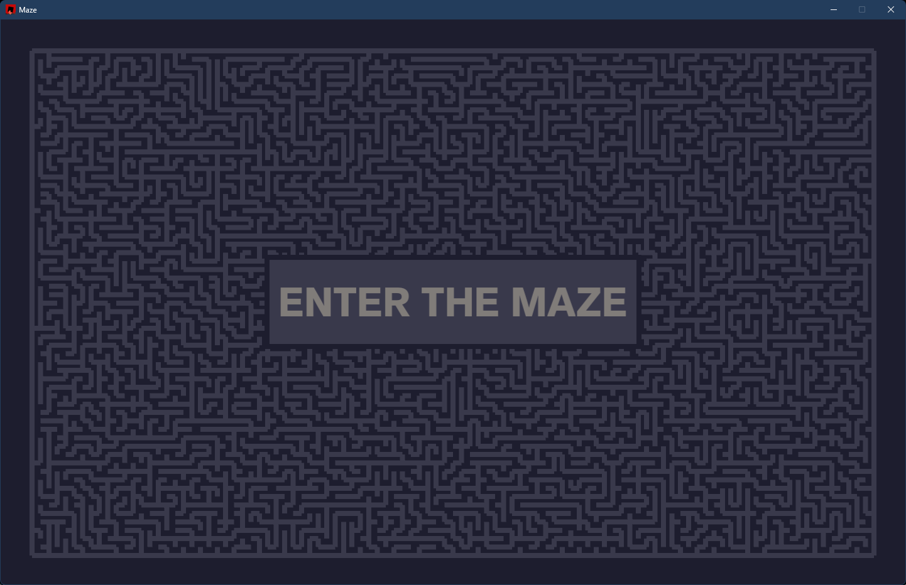
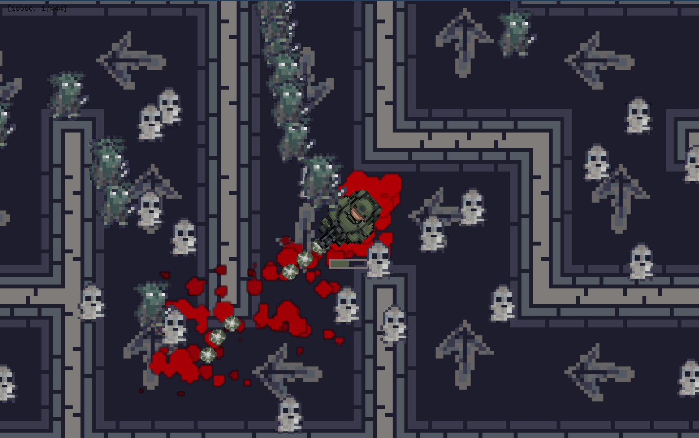
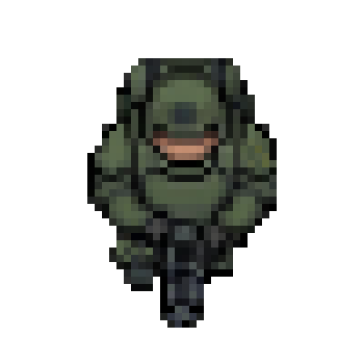
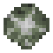
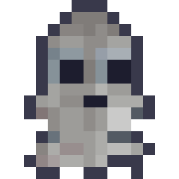
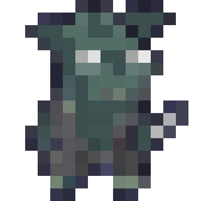

# Labirynth Game (Maze)

A top-down maze game written in Rust using [macroquad](https://github.com/not-fl3/macroquad). Procedurally generate a labyrinth, enter the maze, navigate with WASD, fight enemies, and follow the arrow trail to the finish.

## Screenshots

| Menu | Playing |
|------|---------|
|  |  |


## Gameplay

- **Menu**: Animated maze preview; click **ENTER THE MAZE** to start.
- **Playing**: Centered camera — the world scrolls while the player stays in the middle of the screen.
- **Goal**: Reach the cell marked as the **finish**.
- **Hints**: Arrow sprites on the floor point toward the exit along the correct path.
- **Danger**:
  - Bumping walls damages the player.
  - Enemies deal damage when they get close.

## Controls

| Action | Input |
|--------|--------|
| Move | `W` `A` `S` `D` |
| Sprint | `Left Shift` |
| Shoot | `Left Mouse Button` (hold) or `Space` |
| Regenerate menu maze | `Left Mouse Button` (on menu) |
| Start game | Click **ENTER THE MAZE** |

## How it works

The maze logic lives mainly in `src/labyrinth.rs`, `src/cell.rs`, and `src/CellStep.rs`.

### Maze generation (Hunt-and-Kill)

The labyrinth is built with the **Hunt-and-Kill** algorithm:

1. **Start** at grid cell `(0, 0)`.
2. **Walk**:
   - From the current cell, try the four directions in a **random order** (Fisher–Yates shuffle in `Cell::gen_directions()`).
   - If a neighbor is still unvisited, remove the shared wall on both cells and move there.
   - Repeat until every direction hits a wall or an already visited cell.
3. **Hunt**:
   - Scan the whole grid for any **visited** cell that has an **unvisited** neighbor.
   - If found, jump back to that cell and **walk** again.
4. **Stop** when hunt finds nothing — the maze is complete.

A cell is treated as **visited** once carving has removed at least one of its walls (`walls_bit != 0b1111`). Walls are stored as a 4-bit mask (North, East, South, West).

### Choosing the finish cell

After the maze exists, `find_finish()` picks where the exit goes:

1. Run a **breadth-first search (BFS)** from the start position `(0, 0)` through open passages (no wall between cells).
2. Track which grid cells were reached.
3. The **finish** is the **last cell dequeued** during that BFS — a cell far from the start along the maze’s reachable paths (relative to how neighbors are explored).

That position is stored as `CellStep::Finish` on the grid.

### Path arrows (way to the finish)

`fill_path_to_finish()` builds a direction field so every reachable cell knows which way leads toward the exit:

1. Mark the finish cell as `CellStep::Finish`.
2. BFS **outward from the finish** through open passages.
3. For each newly reached cell, store `CellStep::Direction(dir)` where `dir` is the step **from that cell toward the finish** (the code records the opposite of the edge used during the BFS expansion).

When rendering, `Cell::draw_dir_to_finish()` draws the arrow texture (`arrow3.png`) on each cell and **rotates** it:

| Stored step | Arrow points |
|-------------|----------------|
| North | Up |
| East | Right |
| South | Down |
| West | Left |
| Finish | (arrow at exit) |

Following the arrows from the start walks you along the unique path toward the finish in this maze.

### Enemy pathfinding grid

When you enter the maze, `fill_enemy_grid()` precomputes direction data **for every possible player cell**:

- For each grid position treated as “where the player stands,” run the same style of BFS over the real maze walls.
- Store, for every other cell, which direction an enemy should move to approach that player position.

Enemies read this lookup table at runtime instead of pathfinding from scratch each frame.

## Sprites and assets

Textures and fonts are loaded at runtime from `media/` (paths are relative to the working directory when you run the game).

### In-game sprites

| Asset | Path | Used for |
|-------|------|----------|
| Player | `media/sprites/player/1.png` | Player character (centered, rotates toward mouse) |
| Bullet | `media/sprites/bullet/bullet-green5.png` | Projectile sprite |
| Ghost | `media/sprites/enemy/ghost-cutie-3.png` | Ghost enemy |
| Goblin | `media/sprites/enemy/goblin.png` | Goblin enemy |
| Path arrow | `media/sprites/other/arrow3.png` | Floor arrows toward finish |
| Wall (single) | `media/sprites/cell_wall/top.png` | One open side |
| Wall (corner) | `media/sprites/cell_wall/top-left.png` | Corner piece |
| Wall (T) | `media/sprites/cell_wall/top-left-right.png` | T-junction |
| Wall (corridor) | `media/sprites/cell_wall/top-bot.png` | Straight passage |
| Death frames | `media/sprites/blood/1_0.png` … `1_18.png` | Blood splash animation when enemies die |

Additional files in the repo (not all loaded by the game yet):

| Asset | Path | Notes |
|-------|------|--------|
| Player alt | `media/sprites/player/2.png` | Extra player art |
| Arrow alt | `media/sprites/other/arrow.png` | Earlier arrow graphic |

### UI font

- `media/Akzidenz_Grotesk_Next_Bold.otf` — menu button text

### Presentation (README / showcase only)

| Asset | Path |
|-------|------|
| Menu screenshot | `media/presentation/menu.png` |
| Gameplay screenshot | `media/presentation/playing.png` |
| Recording | `media/presentation/rec.gif` |
| Extra GIF | `media/presentation/play_gif.gif` |
| Video | `media/presentation/play_vid.mp4` |

### Sprite gallery

<p align="center">
  
  
  
  
</p>

## Requirements

- **Rust** (stable) with Cargo
- GPU / drivers for OpenGL (via macroquad / miniquad)

## Getting started

From the project root:

```bash
  cargo build --release
```

## Project structure

| Module | Role |
|--------|------|
| `main.rs` | Window setup, asset loading, main loop |
| `game.rs` | States: menu, playing; game flow |
| `labyrinth.rs` | Hunt-and-Kill, finish BFS, path fill, enemy grid |
| `cellMap.rs` | Grid storage, drawing, maze regeneration |
| `cell.rs` | Wall bits, wall sprites, arrow rendering |
| `CellStep.rs` | `Unvisited`, `Direction`, `Finish` |
| `player.rs` | Movement, collisions, HP, finish check |
| `enemy.rs`, `death.rs` | Enemies and death animation |
| `weapons.rs`, `Bullet.rs` | Gun and bullets |
| `sprites.rs` | Texture loading from `media/` |
| `settings.rs` | Window size, speeds, colors, map dimensions |

## Configuration

Tune gameplay in `src/settings.rs`:

- Window title and resolution (default **1440×900**)
- Menu vs playing maze size (playing grid is **101×101** cells)
- Player speed, HP, sprint
- Enemy stats and spawn behavior
- Bullet size and lifetime
- UI colors

## Tech stack

- [macroquad](https://github.com/not-fl3/macroquad) `0.4.x` — rendering and input
- [rand](https://docs.rs/rand) — maze randomness
- [getset](https://docs.rs/getset) — getters / setters on structs

## License

This project is licensed under the **MIT License**.